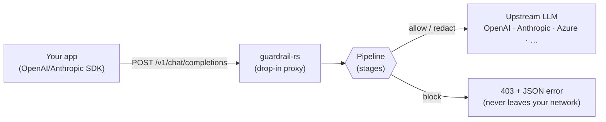

<div align="center">

# guardrail-rs

[](https://github.com/Mattral/guardrail-rs/actions/workflows/ci.yml)
[](https://crates.io/crates/guardrail-cli)
[](https://docs.rs/guardrail-core)
[](https://github.com/Mattral/guardrail-rs/blob/main/LICENSE-APACHE)
[](https://github.com/Mattral/guardrail-rs/blob/main/rust-toolchain.toml)
[](https://visitor-badge.laobi.icu/badge?page_id=Mattral.guardrail-rs)
[](https://colab.research.google.com/github/Mattral/guardrail-rs/blob/main/examples/notebooks/quickstart_colab.ipynb)

</div>

**A zero-Python, production-grade LLM security layer written in Rust.**

`guardrail-rs` is a reverse-proxy that sits between your application and an
LLM provider (OpenAI, Anthropic, Azure OpenAI, or any OpenAI-compatible
endpoint). It inspects every chat-completion request before it leaves your
infrastructure, blocking prompt injection attempts, redacting PII, and
enforcing custom policy rules — all with single-digit-millisecond overhead.

## Installation

```bash
cargo install guardrail-cli
```

This builds and installs the `guardrail` binary from
[crates.io](https://crates.io/crates/guardrail-cli) (Rust 1.75+ required).
Every crate in this workspace — [`guardrail-core`](https://crates.io/crates/guardrail-core),
[`guardrail-classifiers`](https://crates.io/crates/guardrail-classifiers),
[`guardrail-config`](https://crates.io/crates/guardrail-config),
[`guardrail-proxy`](https://crates.io/crates/guardrail-proxy), and
[`guardrail-cli`](https://crates.io/crates/guardrail-cli) — is published
independently, so you can also depend on just `guardrail-core` to embed the
pipeline in your own Rust application with no HTTP server at all.

**Alternatives:**

```bash
# Docker (build locally from the Dockerfile in this repo)
docker build -t guardrail-rs .
docker run -p 8080:8080 -v $(pwd)/guardrail.toml:/etc/guardrail/guardrail.toml guardrail-rs

# ...or the full local stack (guardrail + Ollama + Prometheus + Grafana):
docker compose up -d

# Build from source
git clone https://github.com/Mattral/guardrail-rs.git && cd guardrail-rs
cargo install just  # one-time
just build
```

Want to try it in a couple of minutes with zero local setup? See
[Try it in Colab](#try-it-in-colab) below — it installs Rust, runs
`cargo install guardrail-cli` against the real crates.io release, and
walks through blocking a prompt injection and redacting PII live.

## At a glance

| | |
|---|---|
| **Threat model scope** | Prompt injection, PII leakage (in + out), toxic content, custom policy violations. Does *not* cover adversarial-ML evasion of the classifiers or post-model LLM behavior — full details in [`docs/threat-model.md`](docs/threat-model.md). |
| **Latency** | Regex + PII pipeline: low tens of microseconds per request. Full pipeline with ONNX classifiers: single-digit milliseconds. These are the project's design targets — see [`docs/benchmarks.md`](docs/benchmarks.md) for methodology and CI-enforced latency gates. |
| **Fails open** | A misbehaving stage (e.g. a corrupt ONNX model file) never takes down production traffic by default; configurable per-stage via `on_error = "allow" \| "block"`. |
| **Observability** | Prometheus metrics at `:9090/metrics`, OpenTelemetry traces (OTLP), and an NDJSON audit log — which never contains message content or API keys, only decision metadata. |



## Why guardrail-rs?

- **No Python, no PyTorch, no GPU required.** A single static binary
  (~15 MB), built from the Rust source in this repository.
- **Fast.** Regex injection scanning and PII redaction both run in
  single-digit microseconds; the full pipeline adds well under 1 ms p99 to
  request latency in the default (non-ONNX) configuration.
- **Drop-in.** Point your existing OpenAI/Anthropic SDK's `base_url` at
  `guardrail-rs` — no application code changes required.
- **Fails open by default.** A misbehaving stage never takes down your
  production traffic; configurable per-deployment via `pipeline.on_error`.
- **Hot-reloadable configuration.** Update rules and policies without
  dropping connections.
- **Observable.** Structured audit logs (never logging raw PII) and
  Prometheus metrics out of the box.

## Quick start

Once installed (see [Installation](#installation) above):

```bash
# 1. Copy and edit the example configuration
cp guardrail.example.toml guardrail.toml
# edit guardrail.toml: set [upstream].url

# 2. Validate the configuration
guardrail validate --config guardrail.toml
# (from source: just validate / cargo run -p guardrail-cli -- validate --config guardrail.toml)

# 3. Run the proxy
guardrail run --config guardrail.toml
# (from source: just run / cargo run -p guardrail-cli -- run --config guardrail.toml)
```

Then point your application at `http://localhost:8080` instead of
`https://api.openai.com`:

```python
from openai import OpenAI

client = OpenAI(
    base_url="http://localhost:8080/v1",
    api_key="sk-...",  # forwarded to the real upstream unchanged
)
```

### Environment variable overrides

Configuration can be overridden without editing `guardrail.toml`:

| Variable | Overrides |
|----------|-----------|
| `GUARDRAIL_UPSTREAM` | `upstream.url` |
| `GUARDRAIL_PORT` | `server.port` |
| `GUARDRAIL_LOG_LEVEL` | `observability.log_level` |
| `GUARDRAIL_OTLP_ENDPOINT` | `observability.otlp_endpoint` |

### Hot reload (Unix)

Send `SIGHUP` to reload configuration without dropping connections:

```bash
pkill -HUP guardrail
# or: just reload
```

## What gets checked

| Stage | What it does | Performance target |
|-------|--------------|---------------------|
| `regex_injection` | Fast regex scan for jailbreaks, prompt-extraction attempts, delimiter injection | < 50 µs / 8 KB |
| `onnx_injection` *(optional)* | DeBERTa-based semantic injection detection | < 5 ms / 512 tokens |
| `pii_redactor` | Detects & redacts emails, phone numbers, credit cards (Luhn-validated), SSNs, IPs, API keys | < 20 µs / 4 KB |
| `toxicity` *(optional)* | RoBERTa-based toxicity/harassment detection | < 5 ms / 512 tokens |
| `policy_engine` | Your custom rules: keyword blocks, token-count limits, required-system-prompt checks | negligible |

The `onnx_injection` and `toxicity` stages require building with
`--features onnx` and providing ONNX model files (see [`models/README.md`](models/README.md)).
Everything else works with zero external dependencies.

## CLI

```text
guardrail run --config guardrail.toml       # start the proxy
guardrail validate --config guardrail.toml  # check config without starting
guardrail check "some text" --config guardrail.toml
                                             # run text through the pipeline
                                             # and print the decision as JSON
```

## Configuration

See [`guardrail.example.toml`](guardrail.example.toml) for a fully-annotated
reference configuration, and [`docs/`](docs/) for detailed guides:

- [`docs/architecture.md`](docs/architecture.md) — pipeline design and stage contract
- [`docs/configuration.md`](docs/configuration.md) — full TOML schema reference
- [`docs/policy-rules.md`](docs/policy-rules.md) — writing custom policy rules
- [`docs/deployment.md`](docs/deployment.md) — Docker, Kubernetes, and bare-metal deployment
- [`docs/onnx-models.md`](docs/onnx-models.md) — enabling semantic classifiers
- [`docs/threat-model.md`](docs/threat-model.md) — what guardrail-rs protects against (and what it doesn't)
- [`docs/stage-api.md`](docs/stage-api.md) — implementing custom pipeline stages
- [`docs/benchmarks.md`](docs/benchmarks.md) — performance targets and how to run benchmarks

## Examples

See [`examples/README.md`](examples/README.md) for client examples (curl,
Python, Node.js, Anthropic SDK) against a running proxy. To embed
guardrail-rs as a library with no HTTP server at all:

```bash
cargo run --example minimal -p guardrail-cli
```

### Try it in Colab

[](https://colab.research.google.com/github/Mattral/guardrail-rs/blob/main/examples/notebooks/quickstart_colab.ipynb)

No local setup required. The notebook installs Rust, runs
`cargo install guardrail-cli` against the real published crate on
crates.io, starts the proxy against a small local mock upstream (no API
key needed), and then sends three requests to show:

1. A clean request passing through untouched.
2. A prompt-injection attempt getting blocked with a `403` and the
   `prompt_injection` error code.
3. A message containing an email address getting redacted to `[EMAIL]`
   before it ever reaches the (mock) upstream.

First run takes a few minutes while Rust compiles the crate — that's the
cost of testing the real crates.io artifact rather than a pre-built binary.

## Project layout

```text
crates/
  guardrail-core         # Pipeline trait, request/decision types, policy engine
  guardrail-classifiers  # Regex injection scanner, PII redactor, ONNX classifiers
  guardrail-config       # TOML config schema, validation, hot-reload
  guardrail-proxy        # HTTP server, request forwarding, metrics, audit log
  guardrail-cli          # `guardrail` binary
  guardrail-test-suite   # End-to-end integration tests
```

## Development

```bash
# Install just (task runner)
cargo install just

# Build
just build

# Test (requires cargo-nextest: cargo install cargo-nextest)
just test

# Lint
just lint

# Format
just fmt

# Full CI check locally
just ci

# Generate coverage report (requires cargo-tarpaulin)
just coverage
```

See `justfile` for all available recipes (`just --list`).

## License

Licensed under either of [Apache License, Version 2.0](LICENSE-APACHE) or
[MIT license](LICENSE-MIT) at your option.

## Contributing

Contributions are welcome! Please see [`CONTRIBUTING.md`](CONTRIBUTING.md)
for guidelines on submitting issues and pull requests, including how to add
new prompt-injection rules or PII entity types.
